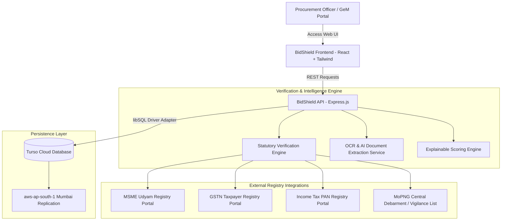

# 🛡️ BidPramaan: GeM Bid Statutory Compliance Verification Platform

> **Smart India Hackathon (SIH26100)**  
> **Target PSU / Ministry:** Chennai Petroleum Corporation Limited (CPCL) • Ministry of Petroleum & Natural Gas (MoPNG)  
> **Database:** Turso Cloud Database (libSQL) replicated in `aws-ap-south-1` (Mumbai)  

---

## 📌 Executive Summary

**BidShield** is an automated, explainable, and fraud-resilient statutory compliance verification platform built for Government e-Marketplace (GeM) public procurement tenders. In high-value PSU procurement (e.g. CPCL refinery piping, valves, and instrumentation), bid evaluation officers historically face manual document inspection backlogs and registry mismatch fraud.

**BidShield** solves this by performing autonomous, multi-point cross-registry checks, extracting OCR data directly from uploaded documents, applying transparent scoring algorithms with fraud override rules, and persisting every action into an immutable audit trail.

---

## 🏛️ System Architecture



---

## ⚡ Key Capabilities

1. **Autonomous 6-Point Statutory Cross-Verification**:
   - **MSME Udyam Status**: Real-time validation of Udyam certificate registration, status, and enterprise category (Micro/Small/Medium).
   - **GSTN Validity**: Validates GSTIN active status and jurisdiction.
   - **GST Returns Filing**: Verifies up-to-date GSTR-3B / GSTR-1 compliance.
   - **Income Tax (PAN)**: Cross-checks PAN validity and active taxpayer status.
   - **MoPNG Vigilance & Debarment**: Instant scan against central debarment registers.
   - **Name Mismatch Detection**: Strict cross-registry entity name match to catch shell companies and identity fraud.

2. **Explainable Scoring Engine**:
   - Transparent 0–100 numeric scoring with clear deduction rationale.
   - **Hard Blacklist Override**: Debarred vendors immediately receive **0/100 (High Risk / Non-Compliant)**.
   - **Identity Fraud Protection**: Name mismatches unconditionally downgrade vendors to at least **Needs Clarification (Medium Risk)**, preventing fraudulent entities from claiming compliance.

3. **Hybrid AI & Computer Vision Document Ingestion**:
   - Ingests scanned PDF and image bids (GST certificates, PAN cards, Udyam certificates).
   - High-accuracy regex extraction with fallback OCR (Tesseract / PDF parser).
   - Automatic discrepancy detection flagging document-to-registry divergence.

4. **Compliance-Aware Tender Awarding**:
   - Integrates commercial L1 pricing alongside statutory compliance scores.
   - Informs procurement officers with prominent audit warnings if awarding contracts to non-compliant vendors under GFR 2017 discretionary authority.

5. **Immutable Audit Ledger**:
   - Every verification, score calculation, document upload, and officer decision is time-stamped with unique UUIDs and cryptographically stored in the cloud.

---

## ☁️ Cloud Database (Turso libSQL)

BidShield uses **Turso Cloud Database (libSQL)** managed through Prisma ORM with `@prisma/adapter-libsql`:
- **Database Endpoint:** `libsql://gem-compliance-snuthon1.aws-ap-south-1.turso.io`
- **Primary Region:** Mumbai, India (`aws-ap-south-1`)
- **Key Tables:** `Bidder`, `UdyamRegistry`, `GstnRegistry`, `PanRegistry`, `BlacklistRegistry`, `VerificationResult`, `AuditLog`, `Tender`, `Bid`, `Document`.

---

## 🚀 Getting Started

### Prerequisites
- Node.js v18+ (Node v20 LTS recommended)
- npm or yarn

### 1. Server Setup
```bash
cd server
npm install
npm run seed     # Seeds initial bidders, tenders, and registries (optional if Turso is live)
npm start        # Runs on http://localhost:5000
```

### 2. Client Setup
```bash
cd client
npm install
npm run dev      # Runs on http://localhost:3000
```

---

## 📊 Health Check

Verify system and cloud database status at:
```http
GET http://localhost:5000/api/health
```

Sample Response:
```json
{
  "status": "healthy",
  "service": "BidShield - GeM Bid Compliance Verification Platform (SIH26100)",
  "database": "Connected (Turso Cloud DB via libSQL: libsql://gem-compliance-snuthon1.aws-ap-south-1.turso.io)",
  "seededBidders": 5,
  "seededTenders": 2,
  "seededBids": 8,
  "timestamp": "2026-09-05T04:47:15.544Z"
}
```

---

## 👥 Authors & Team
- Developed for Smart India Hackathon (SIH26100)
- Project Name: **BidShield**
